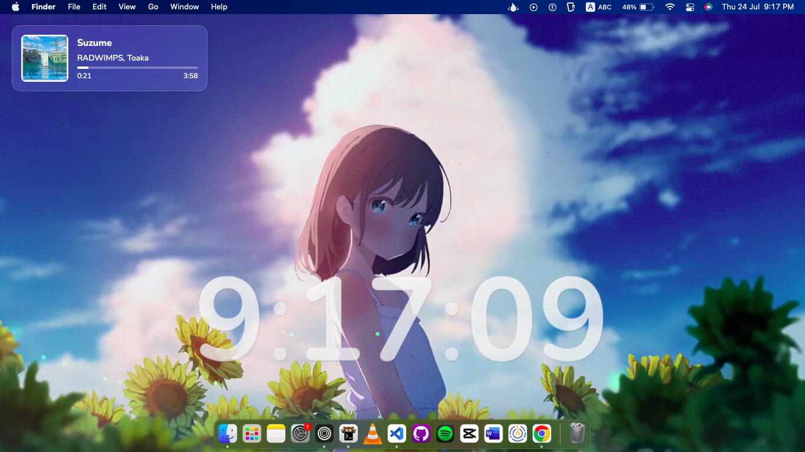

# Livey



**Livey** is a stylish digital clock web app with real-time **Spotify Now Playing** support. Perfect for your desktop or setup dashboard.

## ⚙️ Features

- Real-time Spotify track display  
- Background customization (supports animated GIFs)  
- OAuth login with auto token refresh  

## 🔧 Requirements

- Node.js ≥ 14  
- npm ≥ 6  
- PM2 (for production)  
- Spotify Developer account

## 🚀 Setup

### 1. Clone & Install

```bash
git clone https://github.com/yasakei/livey.git
cd livey
npm install
```

### 2. Spotify API Setup

1. Go to [Spotify Developer Dashboard](https://developer.spotify.com/dashboard/)
2. Create a new app
3. Add `http://localhost:3000/callback` as the redirect URI
4. Copy your `Client ID` and `Client Secret`

### 3. Create `.env`

```env
SPOTIFY_CLIENT_ID=your_spotify_client_id
SPOTIFY_CLIENT_SECRET=your_spotify_client_secret
SPOTIFY_REDIRECT_URI=http://localhost:3000/callback
PORT=3000
```

### 4. Background (Optional)

Drop a `.gif` in the `assets/` folder and update `config.js`:

```js
const gifSource = '/assets/your-background.gif';
```

## 🧪 Run

### Dev Mode

```bash
npm start
```

### Production (PM2)

```bash
npm install -g pm2
pm2 start server.js --name "livey"
pm2 save
pm2 startup
```

## 📦 Project Structure

```
livey/
├── assets/              # Images / GIFs
├── config.js            # Background config
├── server.js            # Main server
├── .env                 # Env vars (not committed)
├── index.html           # UI
└── package.json
```

## 📄 License

`MIT License`